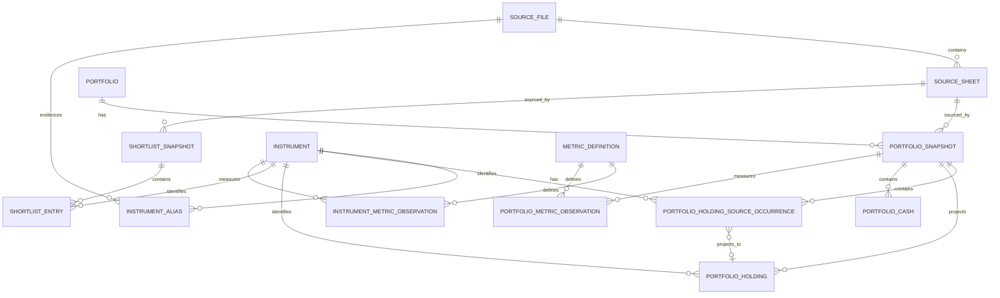

# Milestone 4 — Current Data Audit & ISIN Foundation

Status: planning and audit only. This document does not authorize a schema-v3
migration, a legacy `tbsz` rename, a policy change, or a rewrite of private
LTIA evidence.

## Reproducible audit

Run the deterministic, read-only audit from the repository root:

```bash
poetry run python scripts/audit_milestone_4_current_data.py
```

It writes the ignored local artifact
`data/audit/milestone_4_current_data_audit.json`. The artifact includes source
SHA-256 values, database integrity/foreign-key checks, complete SQLite table
contracts, workbook schema signatures, and the valid-ISIN union. It does not
contain a generation timestamp, so unchanged inputs produce byte-identical
JSON. Existing databases are opened through SQLite `mode=ro`; workbooks are
only read.

The inventory includes the five required stores, discovered SQLite backups under
`database/`, and top-level project SQLite artifacts outside that directory. A
backup is reported as retained historical evidence, never as an active migration
source; an unclassified SQLite file is explicitly excluded from the Milestone 5
migration scope. Every workbook report lists all available sheet names and
visibility, while only visible target sheets are parsed as model or shortlist
data.

The audit considers every visible `modell portfóliók` and `shortlist` sheet in
`data/xls/processed`. It records filename-derived snapshot dates, exact source
headers, product-name and explicit-ISIN coverage, malformed rows, duplicates
within a source sheet, source-schema signatures, and two cross-source conflict
classes: one normalized name mapping to several ISINs, and one ISIN carrying
several product names. It also retains source currencies, asset-class values,
and conflicting ISIN-to-currency/asset-class/sub-asset-class relationships.
A non-empty but checksum-invalid ISIN is malformed and unresolved; it is never
admitted to the registry seed.

The database inventory is the source of truth for the five existing database
roles. `model_portfolio.sqlite` is the legacy model compatibility source,
`official_historical_nav.sqlite` is NAV evidence,
`prospective_portfolio_validation.sqlite` is the append-only prospective
ledger, `tbsz_portfolio.sqlite` is private LTIA evidence under its legacy name,
and `tbsz_current_portfolio.sqlite` is a derived private current-state read
model. The report includes tables, row counts, columns, primary-key positions,
foreign keys, all SQLite indexes (including constraint-created indexes), schema
SQL, versions, and integrity diagnostics.

## Canonical instrument registry

The schema-v3 central analytical database owns a canonical `instrument` row
only for an investable security. Its business identity is the validated,
uppercase ISO 6166 ISIN. `instrument_id` is an internal integer surrogate key;
it must never cross a physical-database boundary. Cross-database security joins
use only ISIN.

The initial registry population rule is deliberately narrow:

```text
union(valid explicit ISINs in all historical model XLS sheets,
      valid explicit ISINs in all historical shortlist XLS sheets)
```

`model_portfolio.sqlite` alone is not a sufficient seed. A registry row may
carry only stable or slowly changing attributes: canonical name, instrument
type, base currency, asset class, sub-asset class, issuer, and active date
bounds. Every value remains attributable to source evidence; a conflict is
retained as a quality finding, never silently overwritten.

Cash is not an instrument. It has no placeholder ISIN and no `instrument` row.
Cash is represented as `currency_code + amount` on a dated account or portfolio
snapshot. A missing cash amount stays missing; it is not interpreted as zero.

### Identity resolution hierarchy

1. A source-supplied, structurally valid explicit ISIN.
2. An already manually confirmed alias for the same source scope.
3. Exact normalized source name resolving to exactly one canonical instrument.
4. Exact confirmed shortlist mapping to exactly one ISIN.
5. Exact confirmed model-portfolio mapping to exactly one ISIN.
6. An authoritative manual resolution, captured with evidence and reviewer.

Any non-unique result is `IDENTITY_AMBIGUOUS`; an absent or invalid explicit
ISIN is `IDENTITY_UNRESOLVED`. Both block automatic cross-source matching. Name
similarity may produce an `IDENTITY_CANDIDATE` review queue item but can never
promote an identity.

## Instrument aliases

`instrument_alias` stores a source-scoped observed name rather than changing
the canonical instrument name. Required fields are `alias_id`, `instrument_id`,
`source_type`, `source_name`, `normalized_source_name`, `source_file_id`
(nullable only where no file exists), `mapping_status`, `valid_from`,
`valid_to`, `resolution_evidence`, and audit timestamps.

Supported source types begin with `MODEL_XLS`, `SHORTLIST_XLS`, `GEORGE_LTIA`,
`NAV_PROVIDER`, and `DIVIDEND_PROVIDER`. Mapping statuses are
`EXPLICIT_ISIN_VALID`, `EXACT_ALIAS_CONFIRMED`, `MANUAL_CONFIRMED`,
`IDENTITY_CANDIDATE`, `IDENTITY_AMBIGUOUS`, and `IDENTITY_UNRESOLVED`.

An exact normalized name may be automatically associated only when it maps to
one existing instrument in the same permitted source scope. The database must
reject conflicting active confirmed aliases for the same `(source_type,
normalized_source_name)` that point to different instruments. A manual decision
requires the original source reference, reason, reviewer, and decision time;
it must not update or erase the source observation. Fuzzy matching is review
only and has no auto-promotion path.

## LTIA reconciliation and current-investments projection

New material uses LTIA terminology, while current code, table, and database
names remain `tbsz` unchanged. The audit reports identity coverage from both
legacy stores, equivalent source-snapshot groups, and cash counts by currency
without exposing values. An unresolved LTIA security stays in source evidence
with `IDENTITY_UNRESOLVED` and blocks automatic target reconciliation.

The proposed canonical projection is:

```text
retained provider evidence
  -> tbsz_portfolio.sqlite (legacy private LTIA evidence authority)
  -> deterministic per-account/per-view source selection
  -> current LTIA investments projection
```

For each account and view (`POSITIONS`, `CASH`), select the latest dated source;
for equal dates select only the source-equivalent group with the same evidence
and position/cash fingerprint. Multiple equivalent source documents remain
retained as evidence but materialize once. Equal undated documents are eligible
only when their payload fingerprint is equal; conflicting undated evidence
fails closed. Positions remain account-level with their exact source snapshot.
Consolidation, if requested later, groups securities only by confirmed ISIN and
cash only by currency, while preserving account provenance. No FX conversion,
netting, value inference, transaction replay, or double counting is allowed.

`tbsz_current_portfolio.sqlite` is a derived compatibility read model, not a
second authority. Schema-v3 must derive the new projection from LTIA evidence;
it must not merge source records with its existing read-model rows.

## Schema-v3 central analytical ERD

This is the design for `database/portfolio_advisor.sqlite` only. Private LTIA
evidence remains physically separate.



Core constraints are `instrument.isin UNIQUE NOT NULL`; unique source file
SHA-256; unique `(portfolio_id, snapshot_date)`; unique
`(source_sheet_id, source_row_number)` raw holding occurrences; and, only for
an explicitly derived analytical projection, unique
`(portfolio_snapshot_id, instrument_id)` holdings; unique
`(portfolio_snapshot_id, currency_code, cash_role)` cash; unique
`(shortlist_snapshot_id, instrument_id)` entries; and provenance fields on all
observations. `portfolio_holding_source_occurrence.reported_weight` is not
adjusted by the migration. A source occurrence may not be silently dropped or
aggregated to make the derived holding uniqueness constraint pass.
`portfolio_cash` has `currency_code`, nullable `amount`/`weight`, `cash_role`,
and source provenance, but never an instrument foreign key.

`metric_definition` owns metric meaning and unit. Instrument and portfolio
metric-observation tables retain observation date, provenance type
(`PROVIDER_REPORTED`, `CALCULATED`, `DERIVED`, or `OBSERVED`), calculation
version where applicable, and `source_file_id`. This design never treats
incompatible provider-reported and calculated values as interchangeable.

Apply foreign keys on every SQLite connection. Required migration validation is
`PRAGMA integrity_check`, `PRAGMA foreign_key_check`, primary/unique checks,
and allocation/count reconciliation. Query-driven indexes must first be
justified using `EXPLAIN QUERY PLAN`; likely access paths are documented in the
roadmap but are not approved merely by this design.

## Schema-v3 migration specification

Milestone 5 may begin only with a separate implementation decision. Its
transactional central-database migration sequence is:

1. Verify the legacy source schema and create a verified backup.
2. Open legacy sources read-only; create an empty central database and enable
   foreign keys.
3. Register immutable source files/sheets and their SHA-256 provenance.
4. Seed instruments from only audited valid explicit ISINs; insert source names
   as aliases with their observed mapping status.
5. Decompose model portfolio identity, dated snapshots, holdings, cash, and
   provider-reported metrics without deriving new facts.
6. Import shortlist snapshots and entries as a universe, never as a portfolio.
7. Record every source row that cannot produce a valid unique identity as an
   unresolved audit/rejection record; do not drop or renormalize the source
   portfolio.
8. Validate row counts, source lineage, allocation totals as reported, schema
   constraints, and ranking equivalence before commit.
9. Roll back on any failed validation. Leave all legacy stores active and
   read-only compatibility sources until the later decommission decision.

No private LTIA data migration, database rename, TBSZ-to-LTIA identifier rename,
NAV reconstruction, outcome admission, ranking rewrite, or shortlist
construction is part of this migration.

## Legacy-versus-relational equivalence plan

Run both repositories against every historical model snapshot supported by the
legacy source. For the unchanged
`CAPITAL_PRESERVATION_RANKING_POLICY v1.0.1`, compare a canonical,
deterministically ordered serialization of:

1. candidate portfolio names and raw reported constituent rows;
2. eligibility status and every rejection reason;
3. all feature values and missing-value states;
4. normalized metric values and score contributions;
5. final scores, deterministic tie-break fields, full rank order, and winner.

The comparison must require exact identity for strings/statuses/order and
decimal-safe equality for numeric values using the existing authoritative
calculation representation. A missing value must compare as missing, not as
zero. Any mismatch is a failed migration validation with a row-level source and
policy diagnostic; there is no tolerance-based acceptance, renormalization, or
fallback to a proxy. The legacy database remains the compatibility oracle until
all supported snapshots pass this suite.
